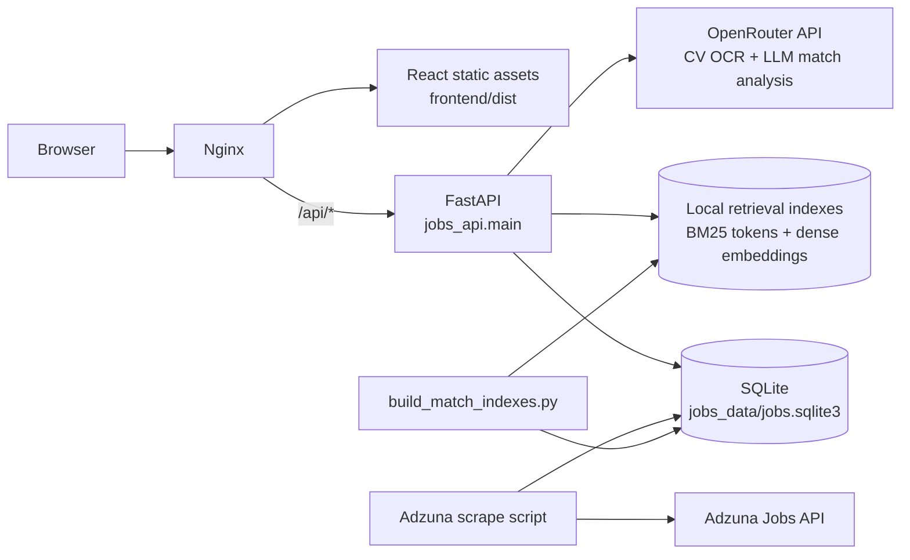
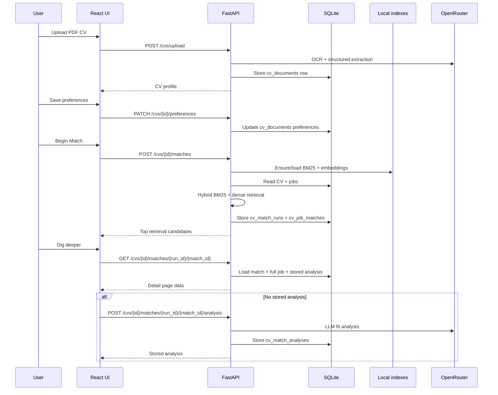

# CV Matchmaker

Local demo for uploading CVs, extracting structured profile data, generating hybrid retrieval job candidates from the SQLite job corpus, and running stored LLM analysis for individual matches.

DivLab9000:
DivLab from The Division of Labor office on Anarres, which assigns individuals to syndicates and oversees rotation of roles (from The Dispossesed, by Ursula Le Guin).
9000 from Hal9000, naturally.

* Currently deployed for demo purposes at: [http://demobox.vps.webdock.cloud/](http://demobox.vps.webdock.cloud/)

## Architecture

DivLab9000 is a small single-host app. The frontend is a static React build served by nginx. The backend is a FastAPI process managed by systemd, backed by SQLite and local retrieval index files. External APIs are only used for job scraping and LLM/OCR work.





Key generated/local artifacts:

- `jobs_data/jobs.sqlite3`: source of truth for jobs, CVs, match runs, and analyses.
- `jobs_data/indexes/bm25_tokens.pkl`: cached BM25 token corpus and job id ordering.
- `jobs_data/indexes/dense_embeddings.npy`: cached local job embedding matrix.
- `jobs_data/indexes/metadata.json`: corpus fingerprint and embedding model metadata.

## Setup

Backend, from the repository root:

```bash
cd jobs_data
uv venv
uv sync
uv run python scripts/migrate.py
```

Frontend, from the repository root:

```bash
cd frontend
npm install
```

## Build Matching Indexes

The first match run can build indexes automatically, but for predictable startup build them explicitly after scraping or changing job data:

```bash
cd jobs_data
uv run python scripts/build_match_indexes.py
```

This creates local generated files under `jobs_data/indexes/`:

- `bm25_tokens.pkl`
- `dense_embeddings.npy`
- `metadata.json`

The default local embedding model is `BAAI/bge-base-en-v1.5`. The script skips rebuilds when the job corpus fingerprint is unchanged. Force a rebuild with:

```bash
uv run python scripts/build_match_indexes.py --force
```

## Run

Start the API:

```bash
cd jobs_data
uv run uvicorn jobs_api.main:app --host 127.0.0.1 --port 8000
```

Start the frontend:

```bash
cd frontend
npm run dev
```

Open the Vite URL shown in the terminal, usually:

```text
http://127.0.0.1:5173/
```

## Matching Flow

1. Upload a PDF CV.
2. Save matching preferences on the CV detail page.
3. Click Begin Match.
4. The API runs synchronous hybrid retrieval, stores the top candidates, and redirects to `/cvs/{id}/matches`.
5. Click Dig deeper on a match to open a full job-detail page and create or view stored LLM analysis.

The first matching stage is retrieval-only. The deeper LLM analysis is run just-in-time for one selected match and is stored for later visits.

OpenRouter configuration:

- `OPENROUTER_KEY` or `OPEN_ROUTER_KEY` is required for CV extraction and Stage 2 analysis.
- `OPENROUTER_MODEL` controls CV extraction and is also the fallback analysis model.
- `OPENROUTER_ANALYSIS_MODEL` can override only the Stage 2 analysis model.

Relevant API endpoints:

- `POST /cvs/upload`
- `PATCH /cvs/{document_id}/preferences`
- `POST /cvs/{document_id}/matches`
- `GET /cvs/{document_id}/matches`
- `GET /cvs/{document_id}/matches/{run_id}`
- `GET /cvs/{document_id}/matches/{run_id}/{match_id}`
- `POST /cvs/{document_id}/matches/{run_id}/{match_id}/analysis`

## Checks

Backend:

```bash
cd jobs_data
uv run ruff check .
```

Frontend:

```bash
cd frontend
npm run lint
npm run build
```
